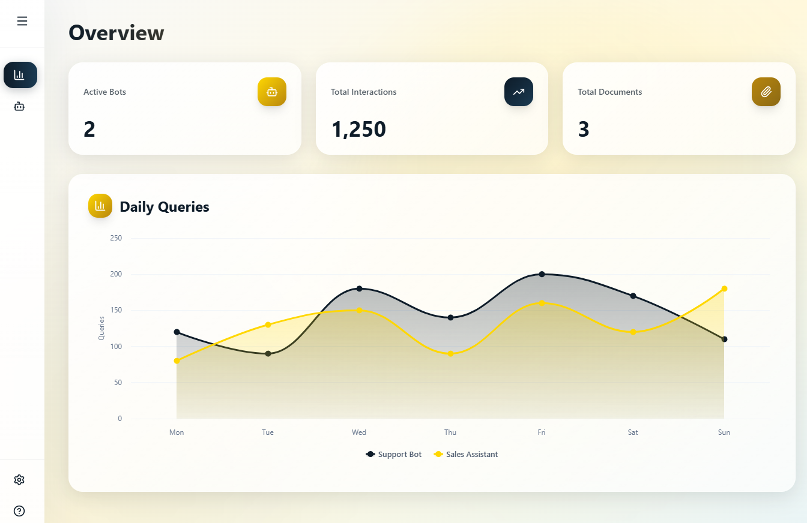
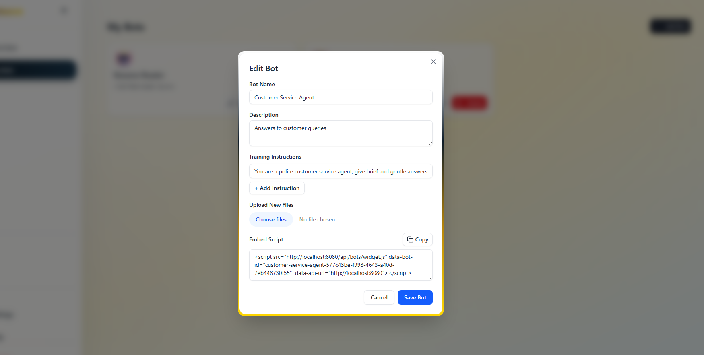
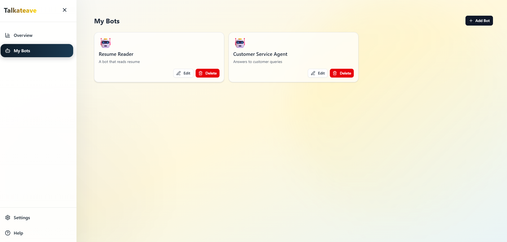
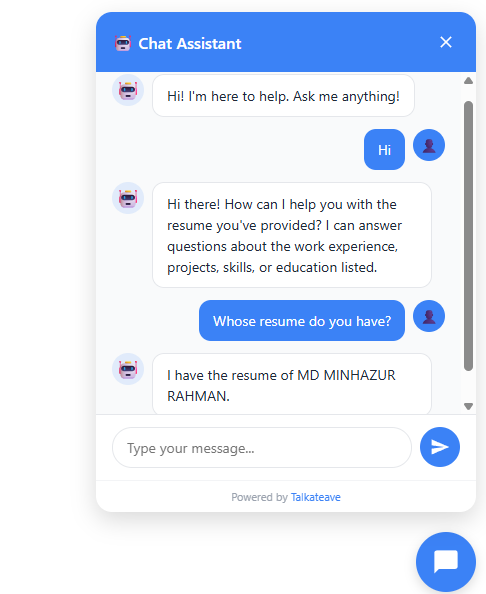

# 🤖 Talkateave

> **Build intelligent chatbots trained on your data and embed them anywhere with a simple script tag.**

Talkateave is a powerful platform that enables users to create custom AI chatbots with RAG (Retrieval-Augmented Generation) capabilities. Train your bots on your own documents and knowledge base, then deploy them on any website with a single line of code.

---

## ✨ Features

- 🔐 **User Authentication** - Secure sign-in and user management
- 🤖 **Custom Bot Creation** - Create unlimited AI chatbots for different use cases
- 📝 **Custom Instructions** - Define personality, tone, and behavior for each bot
- 📄 **Document Upload** - Train bots on PDFs, documents, and text files
- 🧠 **RAG Implementation** - Advanced retrieval system for accurate, context-aware responses
- 🌐 **Easy Embedding** - Deploy bots with a simple `<script>` tag on any website
- 🎨 **Customizable Widget** - Brand your chatbot to match your website design
- ⚡ **Real-time Responses** - Fast, intelligent answers based on your trained data

---

## 🚀 Quick Start

### For Users

1. **Sign Up** at [talkateave.com](https://talkateave.vercel.app)
2. **Create a Bot** and give it a name
3. **Add Instructions** to define how your bot should behave
4. **Upload Files** to train your bot on your knowledge base
5. **Copy the Script Tag** and paste it into your website:

```html
<script src="https://talkateave.onrender.com/widget.js" data-bot-id="your-bot-id"></script>
```

That's it! Your AI chatbot is now live on your website. 🎉

---

## 📸 Screenshots

### Landing Page

*Clean and modern landing page showcasing Talkateave's core features*

### Dashboard

*User dashboard for analytics of your bots*

### Bot Details

*Intuitive interface for creating and configuring new chatbots*

### Bot List

*See your list of bots*

### Chat Widget


*Embedded chat widget seamlessly integrated into any website*

---

## 🛠️ Tech Stack

### Frontend
- **Next.js** - React framework for production
- **Vercel** - Deployment and hosting
- **Tailwind CSS** - Utility-first styling
- **Middleware** - Route protection and authentication

### Backend
- **Spring Boot 3.5.6** - Java 25 backend framework
- **Spring Security** - Enterprise-grade authentication and authorization
- **Spring AI** - AI integration framework
- **Render** - Backend hosting
- **Maven** - Dependency management

### Database & Vector Store
- **PostgreSQL** - Primary relational database
- **pgVector** - PostgreSQL extension for vector embeddings
- **Spring Data JPA** - ORM and database operations
- **Redis** - Caching and session management

### Security
- **JWT (JSON Web Tokens)** - Stateless authentication
- **JJWT 0.12.6** - JWT implementation library
- **HttpOnly Cookies** - Secure token storage

### AI/ML
- **Google Generative AI (Gemini)** - Language model integration
- **Google GenAI Embeddings** - Text-to-vector conversion
- **Apache Tika** - Document parsing and text extraction
- **Apache PDFBox 3.0.6** - PDF processing
- **Apache POI 5.4.0** - Excel/Word document handling

### Documentation
- **Swagger/OpenAPI** - API documentation
- **Springdoc OpenAPI 2.8.13** - Automatic API docs generation

---

## 📋 Architecture

```
┌─────────────┐         ┌──────────────┐         ┌─────────────┐
│   Next.js   │────────▶│  Spring Boot │────────▶│  PostgreSQL │
│  Frontend   │  JWT    │   + Spring   │   JPA   │  + pgVector │
│ (Vercel)    │  Auth   │   Security   │         │             │
└─────────────┘         └──────────────┘         └─────────────┘
                               │                         │
                               │                         │
                        ┌──────▼──────┐          ┌──────▼──────┐
                        │    Redis    │          │   Apache    │
                        │   (Cache)   │          │    Tika     │
                        └─────────────┘          │(Doc Parser) │
                               │                  └─────────────┘
                               │
                        ┌──────▼──────┐
                        │   Google    │
                        │  Gemini AI  │
                        │+ Embeddings │
                        └─────────────┘
```

---

## 🔧 Installation & Development

### Prerequisites
- Node.js 18+ and npm
- Java 25
- PostgreSQL 16+ with pgvector extension
- Redis (for caching)
- Google AI API key (Gemini)

### Backend Setup

```bash
cd talkateave

# Configure application.properties
spring.datasource.url=jdbc:postgresql://localhost:5432/talkateave
spring.datasource.username=your_username
spring.datasource.password=your_password

# Enable pgvector extension in PostgreSQL
# Run this SQL: CREATE EXTENSION IF NOT EXISTS vector;

# JWT Configuration
jwt.secret=your_secret_key_min_256_bits

# Google AI Configuration
spring.ai.google.genai.api-key=your_google_ai_api_key
spring.ai.google.genai.embedding.api-key=your_google_ai_api_key

# Redis Configuration
spring.data.redis.host=localhost
spring.data.redis.port=6379

# Run Spring Boot application
./mvnw clean install
./mvnw spring-boot:run
```

Backend runs on `http://localhost:8080`

**API Documentation**: Visit `http://localhost:8080/swagger-ui.html` after starting the server

---

## 📚 API Documentation

### Authentication

#### Register
```http
POST /auth/register
Content-Type: application/json

{
  "username": "john_doe",
  "email": "john@example.com",
  "password": "securePassword123",
  "confirmPassword": "securePassword123"
}
```

#### Login
```http
POST /auth/login
Content-Type: application/json

{
  "email": "john@example.com",
  "password": "securePassword123"
}
```

### Bot Management

#### Create Bot
```http
POST /api/bots
Authorization: Bearer {token}
Content-Type: application/json

{
  "name": "Customer Support Bot",
  "instructions": ["Be helpful and professional"],
  "description": "Answers customer questions"
}
```

#### Upload Files
```http
POST /api/bots/{botId}/files
Authorization: Bearer {token}
Content-Type: multipart/form-data

file: [your-file.pdf]
```

#### Query Bot
```http
POST /api/bots/widget/ask?botId=${botId}
Content-Type: application/json

{
  "message": "What are your business hours?"
}
```

---

## 📝 License

This project is licensed under the MIT License - see the [LICENSE](LICENSE) file for details.

---

## 🙏 Acknowledgments

- Google Generative AI (Gemini) for language models
- Spring AI team for seamless AI integration
- PostgreSQL and pgVector for vector storage
- Apache Tika, PDFBox, and POI for document processing
- Spring Boot and Next.js communities

---

## 📧 Contact

Have questions? Reach out!

- **Email**: mminhazurrahman0@gmail.com

---

<p align="center">Made with ❤️ by Muhammad Minhaz</p>
<p align="center">⭐ Star it on GitHub if you find this project useful!</p>
